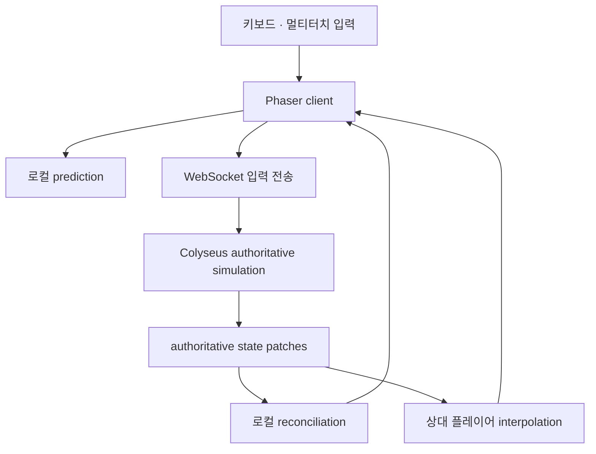

# 지우네 농장 · Multiplayer Lab

실시간 이동만 검증하는 독립 실험입니다. 기존 농장 서버, 인증, D1, `FAMILY_ROOM`, 저장 데이터 또는 Sites 배포에 연결하지 않습니다. 기준 커밋은 `23d6b3a4f7fa5105977062c6678e1a21f818efc1`, 작업 브랜치는 `experiment/v2.4-multiplayer-lab-colyseus`입니다.

## Architecture



- 서버는 `@colyseus/core` **0.18.18**, 브라우저/Node 클라이언트는 `@colyseus/sdk` **0.18.5**, Schema는 **5.0.36**, WebSocket transport는 **0.18.4**입니다. 모든 직접 의존성 및 lockfile을 고정했습니다.
- 서버 simulation은 **30 tick/s**, state patch 목표도 **30회/s**입니다. Schema는 변경 필드만 전송합니다. 실제 patch 수신 빈도와 FPS는 HUD에서 측정합니다.
- 입력은 `moveX`, `moveY`, `run`만 포함합니다. Colyseus가 순서 및 acknowledgment를 관리합니다. x/y 또는 클라이언트 dt를 서버 이동 명령으로 받지 않습니다.
- 서버의 `defineInput()`과 `setFixedTimestep()`을 사용합니다. 한 tick의 기본 처리량은 입력 하나입니다. 짧은 TCP 지연 직후에는 이전에 입력을 받지 못한 tick만 보충하여 최대 두 입력을 처리합니다. 보충 권한은 최대 6 tick(200ms), 유효기간 500ms이며 접속·재접속 때 초기화합니다. 전체 이동량은 실제 경과 tick 예산을 넘지 않습니다. 각 입력을 공용 이동 함수로 따로 계산하고 정확히 acknowledge하므로, 입력을 버린 뒤 처리했다고 응답하지 않습니다. 축 범위·유한값 검증, 제한된 입력 버퍼, 메시지 속도 제한도 함께 사용합니다.
- 클라이언트와 서버는 `shared/applyMovement.ts`를 공유합니다. 대각선 정규화, 맵 경계, 고정 장애물 충돌을 같은 순서로 계산합니다. Phaser의 별도 물리 엔진으로 다시 이동시키지 않습니다.
- 긴 전송 정지로 처리 대기 입력이 3개 이상 남아 1초 동안 줄지 않으면, 서버가 `4010`으로 연결을 재설정합니다. 같은 플레이어를 보존한 공식 reconnect로 오래된 입력을 정리합니다. 짧은 지연은 제한된 따라잡기로 처리하지만, 심한 정지는 연결 상태 전환이 보일 수 있습니다.
- 로컬은 SDK prediction을 사용하고, 권위 상태를 받으면 미확인 입력을 재실행합니다. 화면의 보정은 simulation 상태와 분리해 부드럽게 표시합니다. 상대는 지연된 snapshot 사이를 보간합니다.
- DB는 없습니다. 프로세스가 종료되면 방도 사라집니다. 닉네임과 방 코드는 실험용이며 계정 인증이 아닙니다.

### 디렉터리와 격리

| 위치 | 역할 |
|---|---|
| `client/` | 네트워크 adapter, 입력, Phaser 렌더링, HUD |
| `server/` | Room, Node HTTP/WebSocket 서버, 환경변수·종료 처리 |
| `shared/` | 입력/state schema, 설정 상수, 결정적 이동 |
| `tests/` | 단위·실제 2 client 통합·브라우저 테스트 |
| `dist/server/` | 컴파일한 production Node 서버 |
| `dist/client/` | 독립 배포용 정적 클라이언트 |

기존 앱의 `tsconfig.json`에는 `multiplayer-lab` 제외 항목만 추가합니다. 이는 기존 TypeScript 검사가 실험용 소스와 별도 의존성을 함께 검사하지 않게 하는 경계입니다. 기존 앱 코드, package/lockfile, 배포 설정은 수정하지 않습니다. 새 GitHub Actions workflow는 Lab만 검사하고 배포하지 않습니다.

## Local start

Node.js **22.13 이상**을 사용합니다. 명령은 별도 표시가 없으면 `multiplayer-lab` 디렉터리에서 실행합니다.

```bash
git switch experiment/v2.4-multiplayer-lab-colyseus
cd multiplayer-lab
npm ci
cp .env.example .env
```

서버 터미널:

```bash
npm run dev:server
```

클라이언트 터미널:

```bash
npm run dev:client
```

`http://localhost:5173`을 엽니다. **방 만들기**로 생성한 방 코드를 다른 창/기기에 입력하여 참가합니다. 서버 주소는 `.env`의 `VITE_MULTIPLAYER_SERVER_URL`로 설정합니다. 주소를 바꾼 뒤 Vite를 다시 시작하세요.

### PC 두 창

1. Chrome과 Edge 또는 서로 다른 창 두 개로 클라이언트를 엽니다.
2. 각자 다른 닉네임을 입력합니다. A는 방을 만들고 B는 A의 방 코드로 참가합니다.
3. WASD/방향키로 이동하고 Shift를 함께 누르면 달립니다. 대각선도 가능합니다.
4. 서로 다른 색/이름의 플레이어 두 명과 인원 2가 보이는지 확인합니다.

### PC + Android / 태블릿 · 같은 Wi-Fi

1. PC의 LAN IPv4 주소를 확인합니다. 예: `192.168.0.20`.
2. `.env`를 다음처럼 수정하고 서버/클라이언트를 재시작합니다.

```dotenv
VITE_MULTIPLAYER_SERVER_URL=ws://192.168.0.20:2567
CLIENT_ORIGINS=http://192.168.0.20:5173,http://localhost:5173,http://127.0.0.1:5173
```

3. PC 방화벽에서 개인 네트워크의 TCP 5173/2567 접속을 허용합니다.
4. Android Chrome에서 `http://192.168.0.20:5173`을 엽니다. 휴대폰 주소에 localhost를 넣으면 PC에 연결되지 않습니다.
5. PC와 같은 방에 참가합니다. 왼쪽 이동 컨트롤과 오른쪽 Run 버튼을 두 손가락으로 동시에 누릅니다.
6. 세로/가로 화면, 컨트롤 영역 밖으로 손가락 이동, 손가락 떼기, 앱 전환 후 복귀를 확인합니다.

게스트 Wi-Fi의 기기 간 차단(AP isolation)이 있으면 같은 Wi-Fi여도 연결되지 않습니다. Wi-Fi 테스트만으로 5G 환경까지 통과했다고 판단하지 마세요.

## Internet test와 production build

Colyseus는 **장기 실행 Node.js WebSocket 서버**입니다. 일반 Node 호스팅/VPS/컨테이너에 Lab 전용 서버를 배포하고, 앞단에서 HTTPS/WSS TLS를 종료하세요. 기존 ChatGPT Sites/Cloudflare Workers/기존 농장 도메인에는 배포하지 않습니다.

```bash
npm ci
npm run build:server
VITE_MULTIPLAYER_SERVER_URL=wss://YOUR-LAB-SERVER.example.com npm run build:client
NODE_ENV=production CLIENT_ORIGINS=https://YOUR-LAB-CLIENT.example.com npm start
```

Windows PowerShell에서는 환경변수를 `$env:VITE_MULTIPLAYER_SERVER_URL='wss://...'`처럼 설정한 다음 명령을 실행합니다.

- `dist/client`만 Lab 전용 정적 호스팅에 업로드합니다. URL은 build 시 포함되므로 서버 주소 변경 시 다시 빌드합니다.
- HTTPS 클라이언트는 WSS 서버에 연결해야 합니다. production client build는 누락되거나 `ws://`인 주소를 거부합니다.
- reverse proxy에서 WebSocket Upgrade를 지원하고 연결 timeout을 충분히 길게 설정합니다.
- 서버 `CLIENT_ORIGINS`에 실제 클라이언트 origin을 지정합니다. 경로를 붙이지 않습니다.
- `/healthz`가 응답하는지 확인하고 PC Wi-Fi + Android 5G 조합으로 같은 방에 참가합니다.
- 이 작업에서 공개 서버/도메인을 배포했다는 뜻이 아닙니다. 실제 배포 주소와 인증은 별도로 필요합니다.

## 환경변수

| 변수 | 용도 |
|---|---|
| `VITE_MULTIPLAYER_SERVER_URL` | client build/dev의 `ws://` 또는 `wss://` 서버 주소. production은 WSS 필수 |
| `HOST` | Node bind 주소. 기본 `0.0.0.0` |
| `PORT` | Node 서버 포트. 기본 `2567` |
| `CLIENT_ORIGINS` | 허용할 browser origin의 쉼표 구분 목록. production에서 명시 |
| `NODE_ENV` | production 배포 시 `production` |
| `LAB_LATENCY_MS` | 개발 전용 추가 왕복 지연. 0/50/100/200ms |

`.env.example`과 `.env.production.example`을 참고하세요. 실제 `.env`는 git에서 제외됩니다. Lab에는 DB나 기존 농장 인증 키가 필요 없습니다.

## Network HUD

HUD 버튼으로 표시를 켜고 끕니다. 다음 값을 구분해 봅니다.

- FPS: 실제 화면 업데이트 측정값.
- 연결 상태/방 코드/플레이어 수/reconnect 횟수.
- RTT: SDK의 실제 acknowledgment 기반 측정값. 최초 측정 전에는 미측정 상태입니다.
- tick rate: 서버가 알려주는 고정 simulation 주기. patch rate는 실제 수신 횟수입니다.
- Local position: 로컬 예측 위치. Authoritative position: 마지막으로 받은 서버 위치.
- prediction correction/drift: 권위 상태와 같은 입력 시점에서 비교한 오차. 로컬과 최근 서버 좌표의 단순 차이는 RTT 때문에 정상적으로도 생기는 **예측 선행 거리**이며, 보정 오차와 구별합니다.
- TCP WebSocket에 대한 가짜 packet-loss 지표는 표시하지 않습니다.

## 지연 시뮬레이션

서버를 종료한 뒤 다음 중 하나로 재시작하고 방에 다시 참가합니다.

```bash
LAB_LATENCY_MS=0 npm run dev:server
LAB_LATENCY_MS=50 npm run dev:server
LAB_LATENCY_MS=100 npm run dev:server
LAB_LATENCY_MS=200 npm run dev:server
```

Colyseus 공식 `simulateLatency()`를 사용합니다. 설치된 버전은 **추가 왕복 지연**의 절반을 송신/수신에 각각 적용합니다. 실제 인터넷 RTT에 더해지는 값입니다. 모바일 대역폭 저하, TCP head-of-line blocking, 무선 재전송, OS background suspension을 모두 재현하는 도구는 아닙니다. production에서 지연 시뮬레이션을 활성화하지 않습니다.

## Reconnect

일시 단절 시 연결 상태가 바뀌고 최대 10회 재연결을 시도합니다. 서버는 30초 동안 자리를 보존하며, 재접속하면 같은 플레이어를 회복합니다. 클라이언트는 공식 `client.reconnect(token)`을 사용하고 예약된 재시도를 직접 취소·정리합니다. SDK의 자동 retry와 중복 실행하지 않습니다. 기한이 지나거나 명시적으로 방을 나가면 해당 플레이어를 삭제합니다. 실패하면 로비에서 같은 방 코드로 다시 참가하거나 새 방을 만드세요. 프로세스 재시작 후 사라진 방은 복구할 수 없습니다.

## 테스트

```bash
npm run typecheck
npm run test:unit
npm run test:integration
npm run build:server
VITE_MULTIPLAYER_SERVER_URL=wss://lab-validation.invalid npm run build:client
npx playwright install chromium
npm run test:browser
```

`lab-validation.invalid`는 **빌드 검증용**이며 실제 플레이 주소가 아닙니다. 실사용 빌드는 실제 서버 주소로 교체해야 합니다. Linux CI에서 필요한 경우 `npx playwright install --with-deps chromium`을 사용합니다. 실제 실행 결과와 환경상 미검증 항목은 [VALIDATION.md](./VALIDATION.md)에 기록합니다.

## Docker

Lab 디렉터리를 build context로 사용합니다. 이 이미지는 **서버 전용**입니다. 정적 클라이언트는 별도 빌드/호스팅합니다.

```bash
docker build -t jiwoos-multiplayer-lab .
docker run --rm --init --name jiwoos-lab -p 2567:2567 \
  -e CLIENT_ORIGINS=https://YOUR-LAB-CLIENT.example.com \
  jiwoos-multiplayer-lab
```

컴파일한 `dist/server/index.js`를 `npm start`로 실행하고 non-root 사용자, healthcheck, SIGTERM/SIGINT 종료 처리를 사용합니다. TLS는 별도 reverse proxy에서 제공합니다. `docker stop jiwoos-lab`으로 종료합니다.

## 사람이 수행할 benchmark

| Test | 장치/네트워크 | 상태 |
|---|---|---|
| A | PC Chrome + PC Edge | 수동 확인 필요 |
| B | PC Chrome + Android Chrome / 같은 Wi-Fi | 실제 기기 확인 필요 |
| C | PC Wi-Fi + Android 5G | 실제 기기 확인 필요 |
| D | 태블릿 Chrome + PC / 세로·가로 전환 | 실제 기기 확인 필요 |

각 조합에서 normal/추가 RTT 50/100/200ms로 아래를 수행합니다.

- [ ] 걷기 30초
- [ ] 방향을 빠르게 번갈아 바꾸기
- [ ] 장애물 주변을 원형으로 이동하기
- [ ] 걷다가 달리기, 달리다가 멈추기
- [ ] 대각선 이동과 맵 경계·장애물 충돌
- [ ] 두 사람이 동시에 서로 다른 방향으로 이동하기
- [ ] 5분 이상 연속 이동
- [ ] 앱/탭을 background로 보냈다가 복귀
- [ ] Wi-Fi를 잠깐 끊었다가 복구
- [ ] reconnect 기한보다 오래 끊은 뒤 수동 재참가
- [ ] 모바일 이동 + Run 멀티터치, pointer cancel 이후 입력 해제

매 회차 다음 표를 채웁니다. 측정값이 없으면 추정 수치를 쓰지 않습니다.

| 날짜/기기/네트워크/추가 RTT | local input delay | remote stutter | teleport | correction jump | disconnect/reconnect | RTT/FPS 관찰 |
|---|---|---|---|---|---|---|
| 미실시 | | | | | | |

통과 판단: 로컬이 서버 왕복을 기다리지 않고 움직임, 상대가 patch마다 계단식으로 이동하지 않음, 장애물 근처에서 반복적인 순간이동 없음, 재접속 후 유령 플레이어·중복 입력 없음. 실제 기기에서 반복 보정이 보이면 HUD와 화면 녹화를 함께 남깁니다.

## 알려진 제한사항과 다음 단계

- 공개 운영 인증·영구 저장·다중 서버 확장·악성 트래픽 방어 전체를 구현한 게임 서버가 아닙니다. input validation/rate limit은 Lab의 이동 권한을 보호합니다.
- 네트워크가 장시간 끊기거나 브라우저가 background에서 중단되면 계속 부드럽게 보이는 것을 보장할 수 없습니다. reconnect 및 상태 복구로 처리합니다.
- 결정적 이동 검증 범위는 정적인 2D 테스트 맵입니다. 플레이어끼리의 물리 충돌, 농사·인벤토리·NPC 등은 포함하지 않습니다.
- `NetworkAdapter`는 다음 비교 백엔드의 경계입니다. Cloudflare DO 백엔드는 이 단계에서 구현/배포하지 않습니다. 기존 `FAMILY_ROOM`을 재사용하지 않습니다.
- `run`은 boolean wire schema입니다. 일반 JavaScript 클라이언트가 잘못된 문자열을 넣으면 SDK 인코더가 전송 전에 boolean으로 바꿀 수 있습니다. 서버는 원래 문자열을 복원하지 못하지만 최종 이동은 항상 걷기/달리기 상한 안에 있으며 입력 폭주로 상한을 늘리지 못합니다. 공용 sanitizer는 원본 JavaScript 입력에서도 `true`만 달리기로 인정합니다.
- 실기기 benchmark를 통과하기 전 기존 농장으로 이식하지 않습니다. 다음 작업은 공개 Lab 전용 테스트 환경, 한국 내 RTT 관찰, reconnect/5분 이상 연속 플레이 검증입니다. 이후 영구 상태 명령을 이동 stream과 분리해 단계적으로 이식합니다.

## 확인한 공식 문서

2026-10-06 기준 문서와 설치 패키지의 타입/구현을 함께 확인했습니다.

- [Server Input & Fixed Timestep](https://docs.colyseus.io/netcode/server-input)
- [Client Prediction & Reconciliation](https://docs.colyseus.io/netcode/client-prediction)
- [Determinism & The Contract](https://docs.colyseus.io/netcode/determinism)
- [Reconnection Handling](https://docs.colyseus.io/room/reconnection)
- [SDK Connection Lifecycle](https://docs.colyseus.io/sdk/connection)
- [Server / latency simulation](https://docs.colyseus.io/server)
